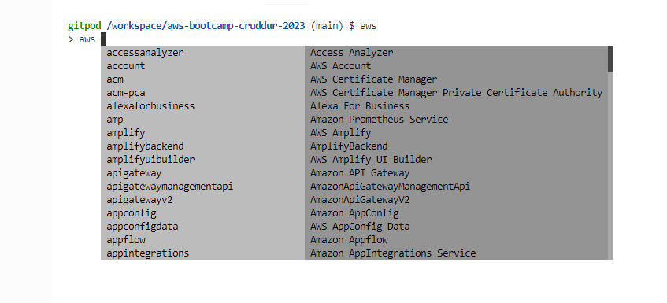
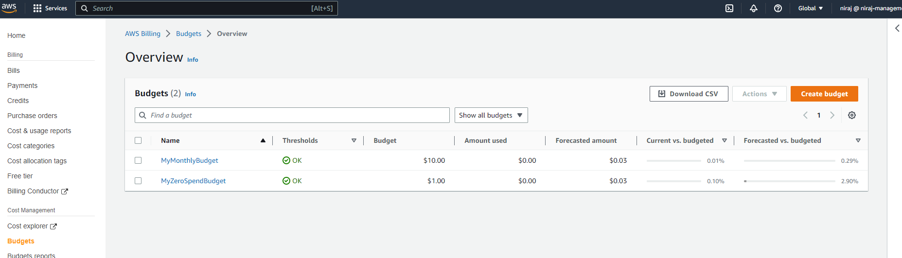

# Week 0 — Billing and Architecture

# Watched videos and completed the steps in my AWS account
1. Chirag's Week 0 - Spend Considerations
2. Ashish's Week 0 - Security Considerations

# Created an admin user

# Installed AWS CLI

# Created a budget

# Created a billing alarm

# Created conceptual diagram

# Created logical diagram

[Lucid Link](https://lucid.app/lucidchart/9a6b4a38-64cd-4210-abdb-7c687ad2803a/edit?invitationId=inv_6f0fb53d-1e8c-40b7-b770-8a1e6ed08a31&page=0_0#)
